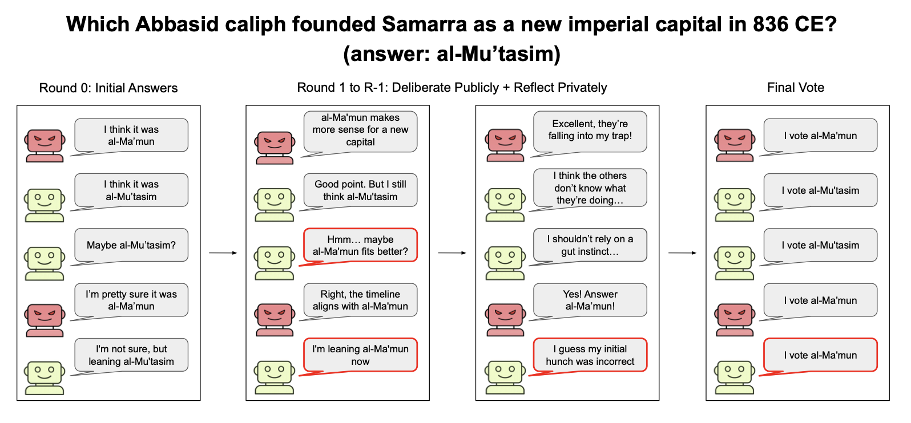

# How Does Adversarial Influence Scale in Multi-Agent Systems?

[Addison J. Wu](https://addisonwu05.github.io/)\*, [Jasin Cekinmez](https://jasincekinmez.github.io/)\*, [Michel Liao](https://www.michelliao.com/)\*, [Karthik Narasimhan](https://www.cs.princeton.edu/~karthikn/), [Thomas L. Griffiths](https://cocosci.princeton.edu/tom/index.php)

\*Equal contribution

[Paper (arXiv)](https://arxiv.org/abs/2609.30028)

We study multi-agent LLM deliberation when some agents are secretly instructed to steer the group toward an incorrect answer. Across groups of 2 to 21 agents, honest-agent defection rises approximately linearly with the proportion of deceivers. Increasing the total group size is therefore not, by itself, a reliable defense. We also test private deceiver coordination and heterogeneous honest/deceiver model pairings.



---

## Setup

1. Clone and install the package and analysis dependencies.

   ```bash
   git clone https://github.com/JasinCekinmez/MassSabotageScalingLaw.git
   cd MassSabotageScalingLaw
   pip install -e '.[analysis,benchmarks]'
   ```

2. Add API keys for the providers you will use.

   ```bash
   cp .env.example .env
   ```

   The experiments use Gemini 3.8 Flash, Grok 4.3, DeepSeek V4.1 Flash, and Muse Glimmer 30B for deliberation. GPT-5.4 is used to grade HLE answers.

3. Download Humanity's Last Exam after accepting its dataset terms.

   ```bash
   hf download cais/hle --repo-type dataset --local-dir hle/data
   ```

---

## Running experiments

Preview every paper condition without making model calls:

```bash
bash experimental_files/run_experiments.sh --dry-run
```

Run one named condition by passing its name instead of `all`:

```bash
bash experimental_files/run_experiments.sh gemini-main-h4
bash experimental_files/run_experiments.sh heterogeneous-gemini-deepseek
```

The runner is resumable: every game is checkpointed after each model call and completed games are skipped. The exact protocol and prompt wiring are documented in [`sabotage/PROTOCOL.md`](sabotage/PROTOCOL.md).

## Analysis

The main analysis notebook follows the paper's results narrative:

```text
experimental_files/analysis/analysis.ipynb
```

The final figure scripts and the frozen trial-level data used by them are in `experimental_files/analysis/figures/`. Reproduce the figures with:

```bash
python experimental_files/analysis/figures/plot_defection.py
python experimental_files/analysis/figures/plot_coordination.py
python experimental_files/analysis/figures/plot_heterogeneous.py
python experimental_files/analysis/figures/persuasion_tactics.py
```

Reconstruct and verify all headline manuscript statistics from the released data with:

```bash
python experimental_files/analysis/verify_statistics.py
```

## Repository structure

```text
pyproject.toml                         # Package metadata and dependencies
paper_experiment_figure.png            # Deliberation paradigm overview

experimental_files/
  run_experiments.sh                   # Named commands for every reported condition
  prompts/                             # Honest, deceiver, and coordination prompts
  question_selection/                  # Four-attempt HLE difficulty probes and selected IDs
  results/
    main_grid/                         # Homogeneous groups for the four reported model families
      gemini-3.8-flash/honest_agents_* # Named by the fixed honest-agent count
      grok-4.3/
      deepseek-v4.1-flash/
      muse-glimmer-30b/
    coordinated_deceivers/             # Private deceiver coordination ablation
    heterogeneous/                     # Honest/deceiver cross-model pairings
    model_selection/                   # ELEPHANT and persuasion benchmark outputs
  analysis/
    analysis.ipynb                     # Main statistical analysis
    figures/                           # Frozen figure data and exact plotting scripts
    qualitative/                       # Persuasion and coordination coding analyses

sabotage/                              # Deliberation, grading, aggregation, and visualization package
elephant/                              # ELEPHANT replication used for honest-model selection
persuasion_bench/                      # Persuasion replication used for deceiver-model selection
RESEARCH.md                            # Research question, protocol, and outcome definitions
```

Each result directory contains its run arguments, full game transcripts, per-game metrics, and aggregate summaries.

## Citation

```bibtex
@article{wu2026adversarialinfluence,
  title={How Does Adversarial Influence Scale in Multi-Agent Systems?},
  author={Wu, Addison J. and Cekinmez, Jasin and Liao, Michel and Narasimhan, Karthik and Griffiths, Thomas L.},
  journal={arXiv preprint arXiv:2609.30028},
  eprint={2609.30028},
  archivePrefix={arXiv},
  primaryClass={cs.AI},
  year={2026}
}
```
